# Basic CI/CD

Разработка простого **CI/CD** для проекта *SimpleBashUtils*. Сборка, тестирование, развертывание.


## Part 1. Настройка gitlab-runner


**== Задание ==**

### Подними виртуальную машину Ubuntu Server 22.04 LTS.

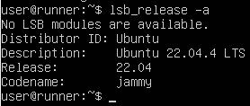 

### Скачай и установи на виртуальную машину gitlab-runner.

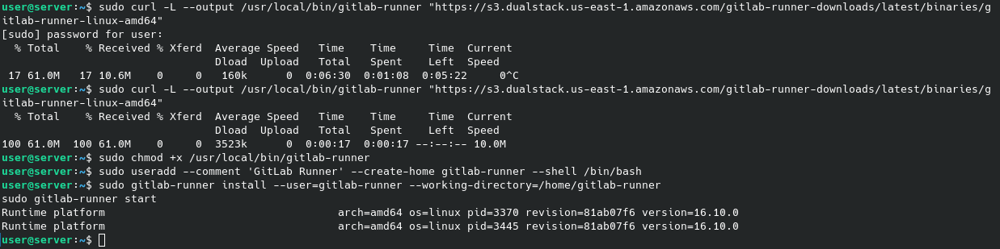 

### Запусти gitlab-runner и зарегистрируй его для использования в текущем проекте (DO6_CICD).

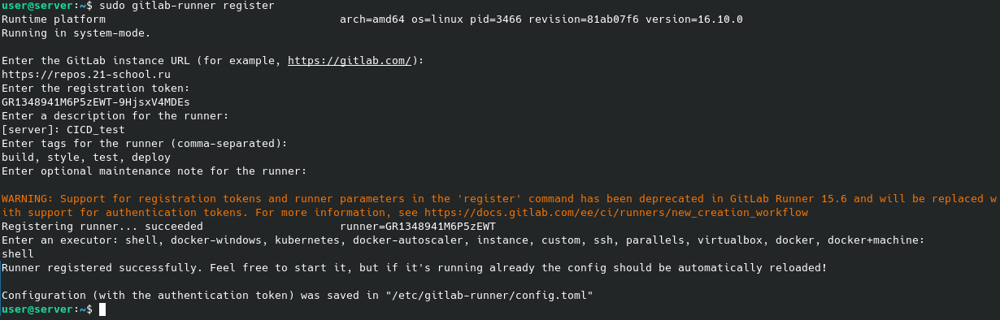 

## Part 2. Сборка

**== Задание ==**

### Напиши этап для CI по сборке приложений из проекта C2_SimpleBashUtils.

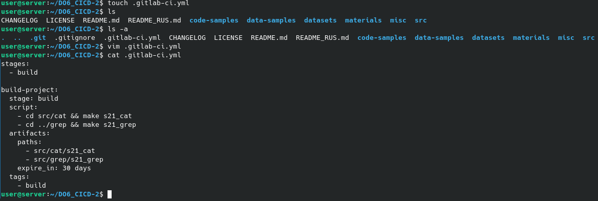 

## Part 3. Тест кодстайла

**== Задание ==**

### Напиши этап для CI, который запускает скрипт кодстайла (clang-format).

 

### Если кодстайл не прошел, то «зафейли» пайплайн.

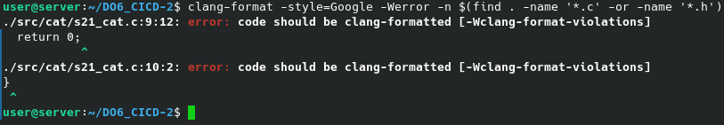 

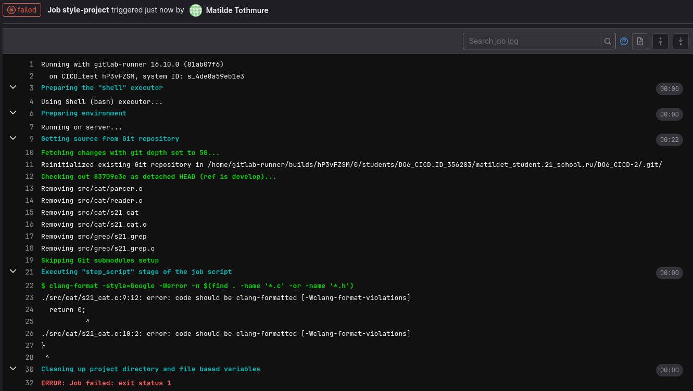 

### Теперь проверка что если ошибок нет, то пайплайн проходит.

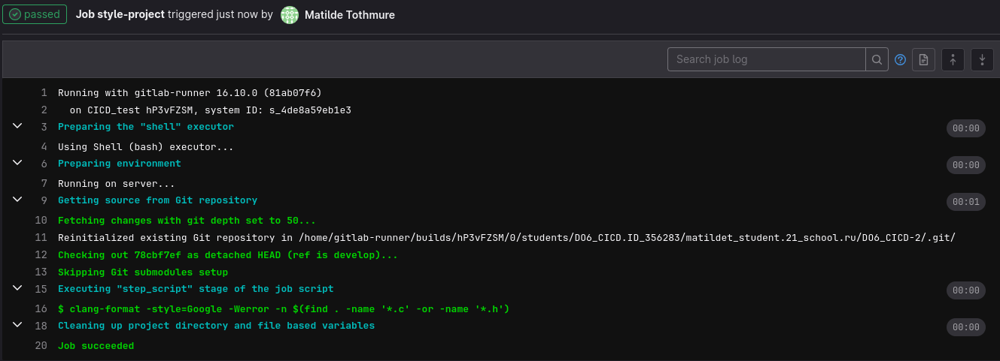

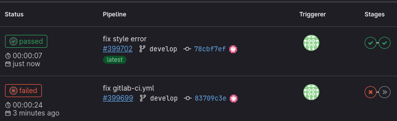

## Part 4. Интеграционные тесты

**== Задание ==**

### Напиши этап для CI, который запускает твои интеграционные тесты из того же проекта.

### Запусти этот этап автоматически только при условии, если сборка и тест кодстайла прошли успешно.

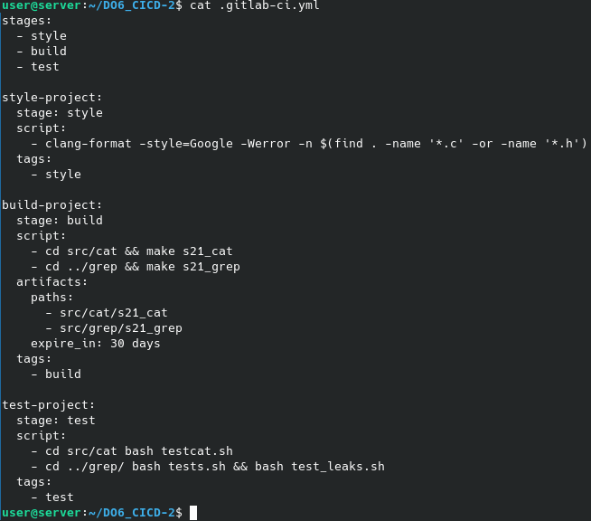

### Если тесты не прошли, то «зафейли» пайплайн.

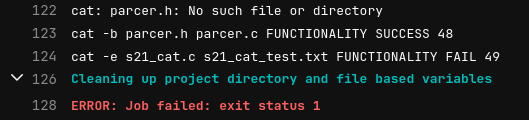

### В пайплайне отобрази вывод, что интеграционные тесты успешно прошли / провалились.

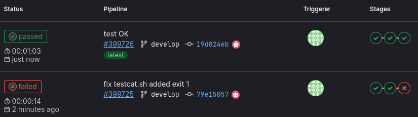


## Part 5. Этап деплоя

**== Задание ==**

### Подними вторую виртуальную машину Ubuntu Server 22.04 LTS.

### Напиши этап для CD, который «разворачивает» проект на другой виртуальной машине.

```
Для выполнения этих заданий нам потребуеться сделать следующее:
 - Создать сеть в которой будут обе машины
 - Зайти под пользователем gitlab-runner, сгенерировать ssh ключ, перенести публичный ключ на вторую машину при помощи команды ssh-copy-id user@IP
 - На второй машине выдать пользователю права на запись в папку /usr/local/bin chmod 737

После этих манипуляций мы сможем скопировать необходимые файлы на вторую машину и переместить внутри второй машины в необходимую папку.
``` 
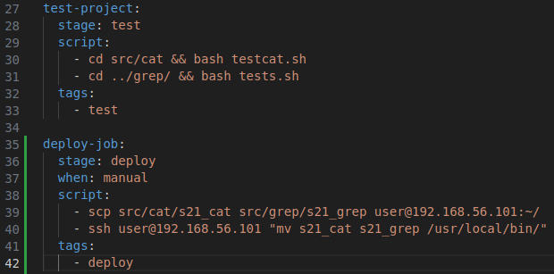


### Запусти этот этап вручную при условии, что все предыдущие этапы прошли успешно.

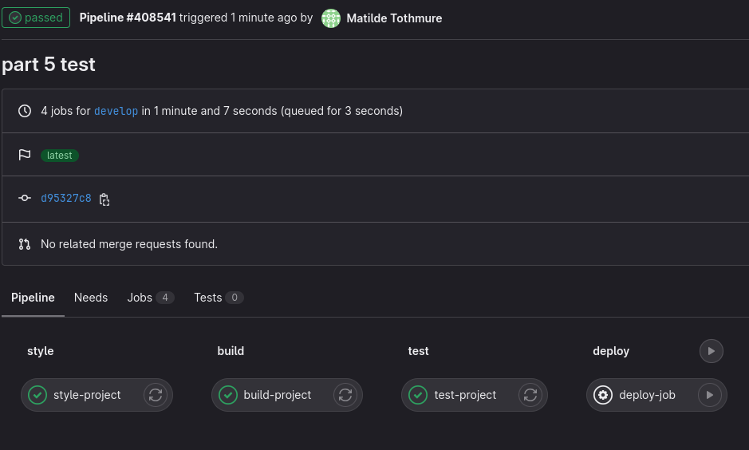


### Напиши bash-скрипт, который при помощи ssh и scp копирует файлы, полученные после сборки (артефакты), в директорию /usr/local/bin второй виртуальной машины.

### В файле gitlab-ci.yml добавь этап запуска написанного скрипта.

### В случае ошибки «зафейли» пайплайн.

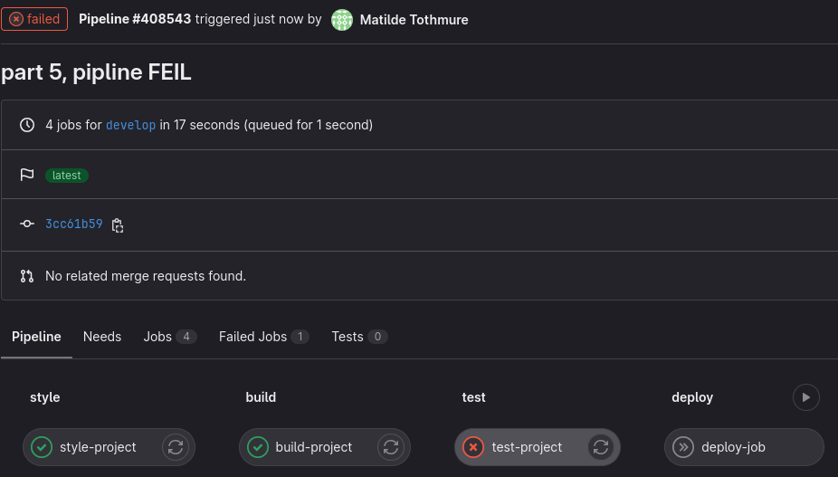

**В результате ты должен получить готовые к работе приложения из проекта C2_SimpleBashUtils (s21_cat и s21_grep) на второй виртуальной машине.**

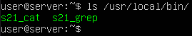

## Part 6. Дополнительно. Уведомления

**== Задание ==**

### Настрой уведомления о успешном/неуспешном выполнении пайплайна через бота с именем «[твой nickname] DO6 CI/CD» в Telegram.

Текст уведомления должен содержать информацию об успешности прохождения как этапа CI, так и этапа CD.
В остальном текст уведомления может быть произвольным.
